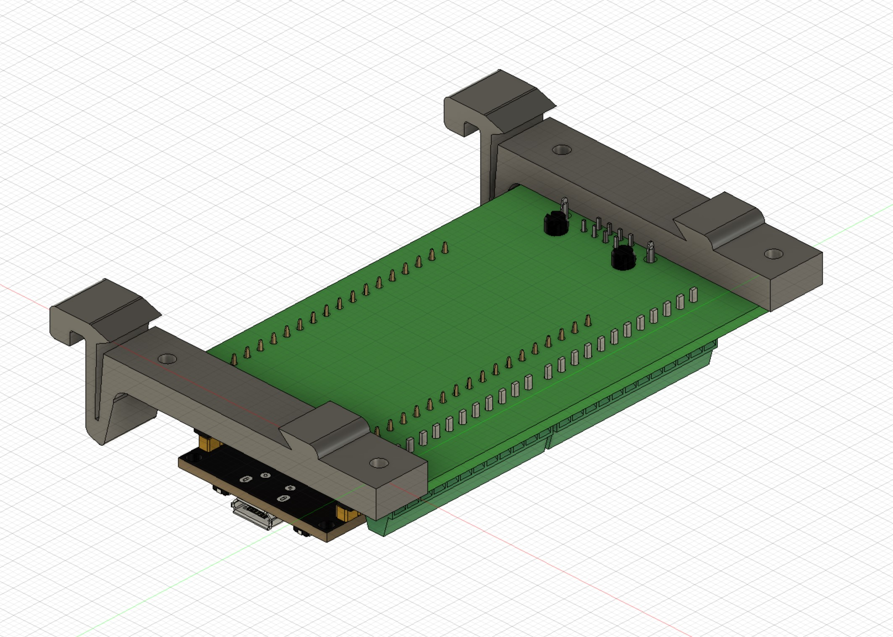

 3D Model
===

<table><tr><td valign="top">

Importa il file .step in un software per il disegno 3d come fusion 360, e crea il case da stampare in 3d. 
 
</td><td></td></tr>
<tr><td valign="top">

Il file din-rail.stl può essere stampato per agganciare la board ad una guida din 
 
</td><td></td></tr></table>
