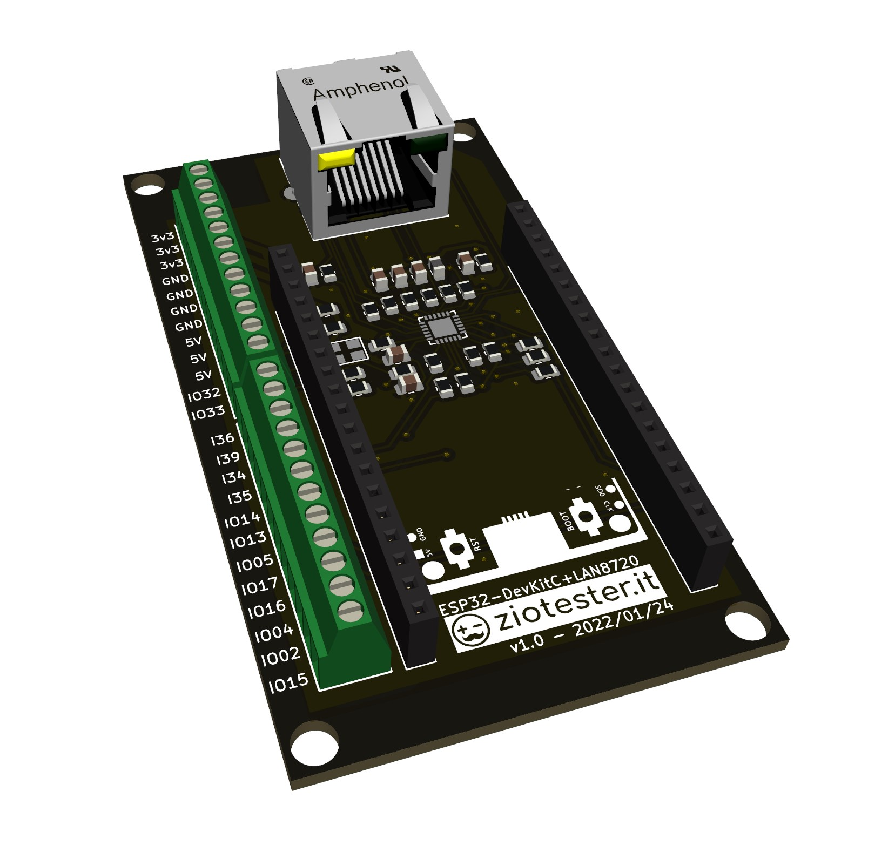

 3D Model
===

<table><tr><td valign="top">

Importa il file .step in un software per il disegno 3d come fusion 360, e crea il case da stampare in 3d. 
 
Rilasceremo a breve una nostra versione di case realizzato per la board.</td><td></td></tr></table>
