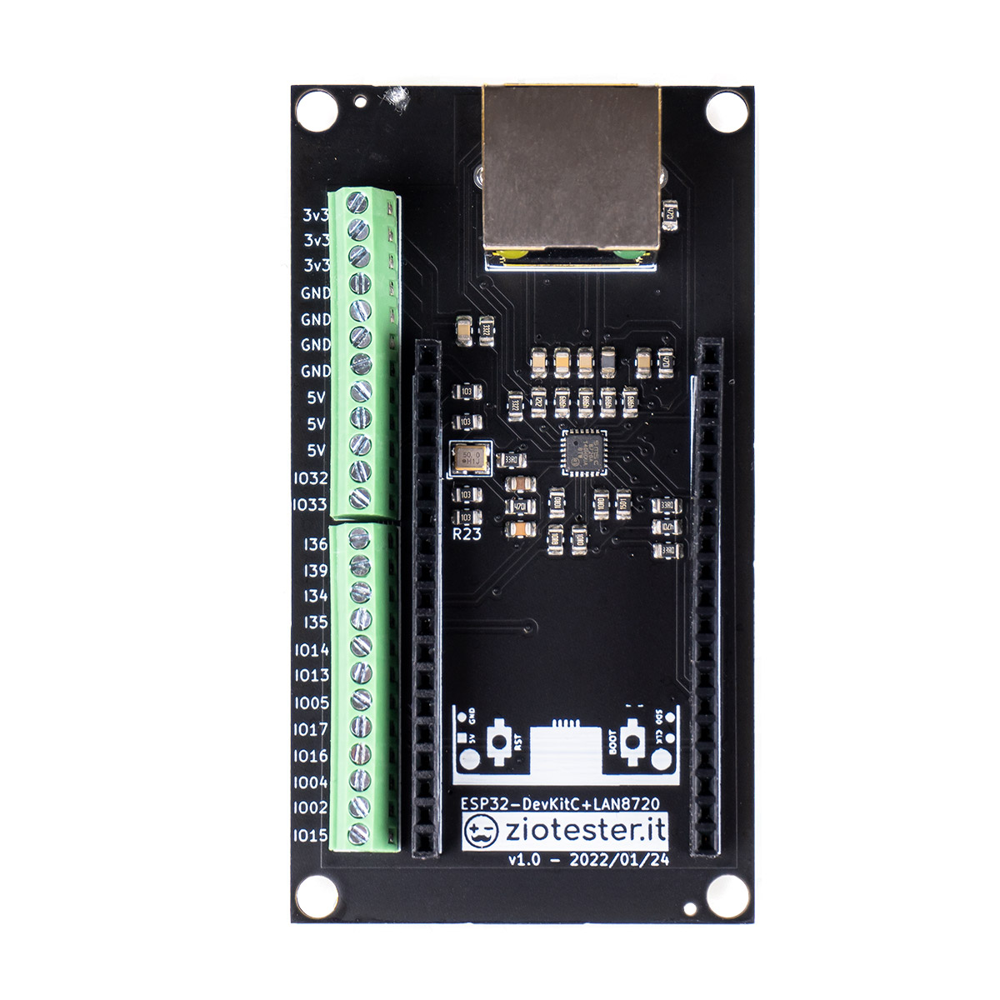
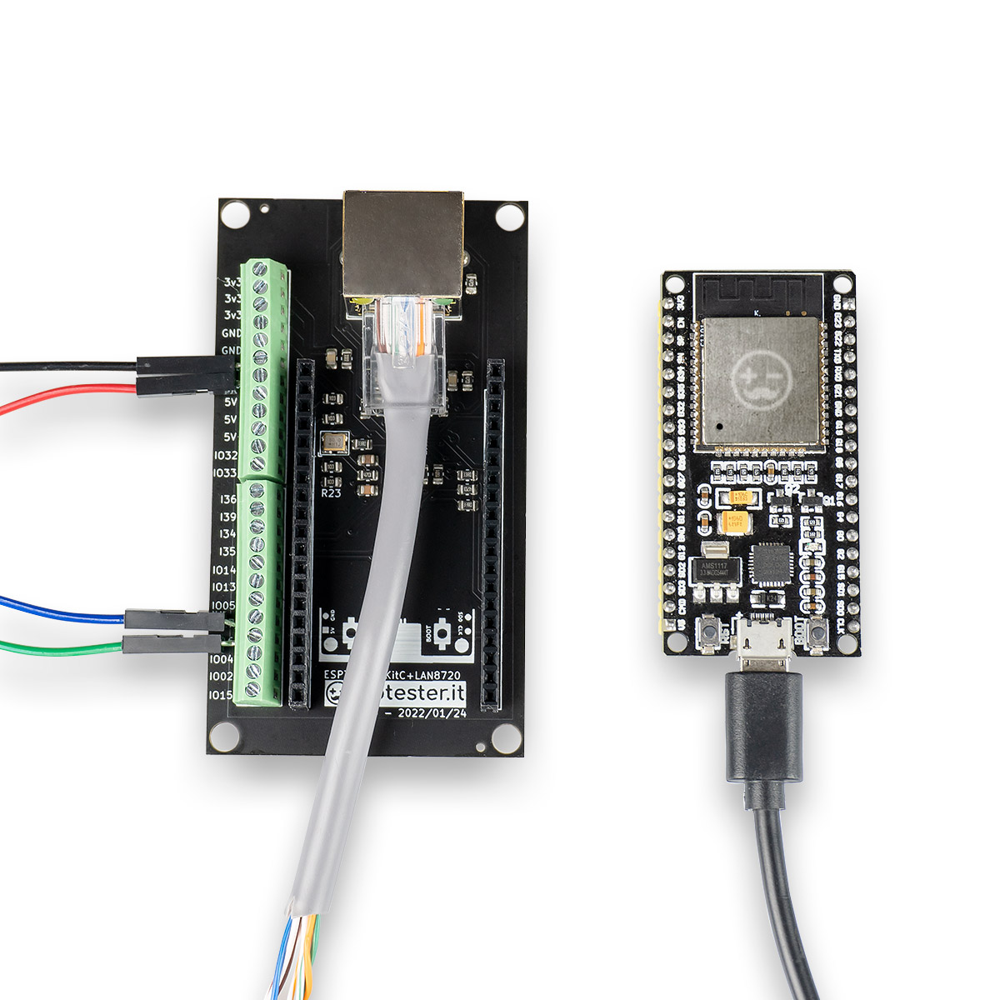
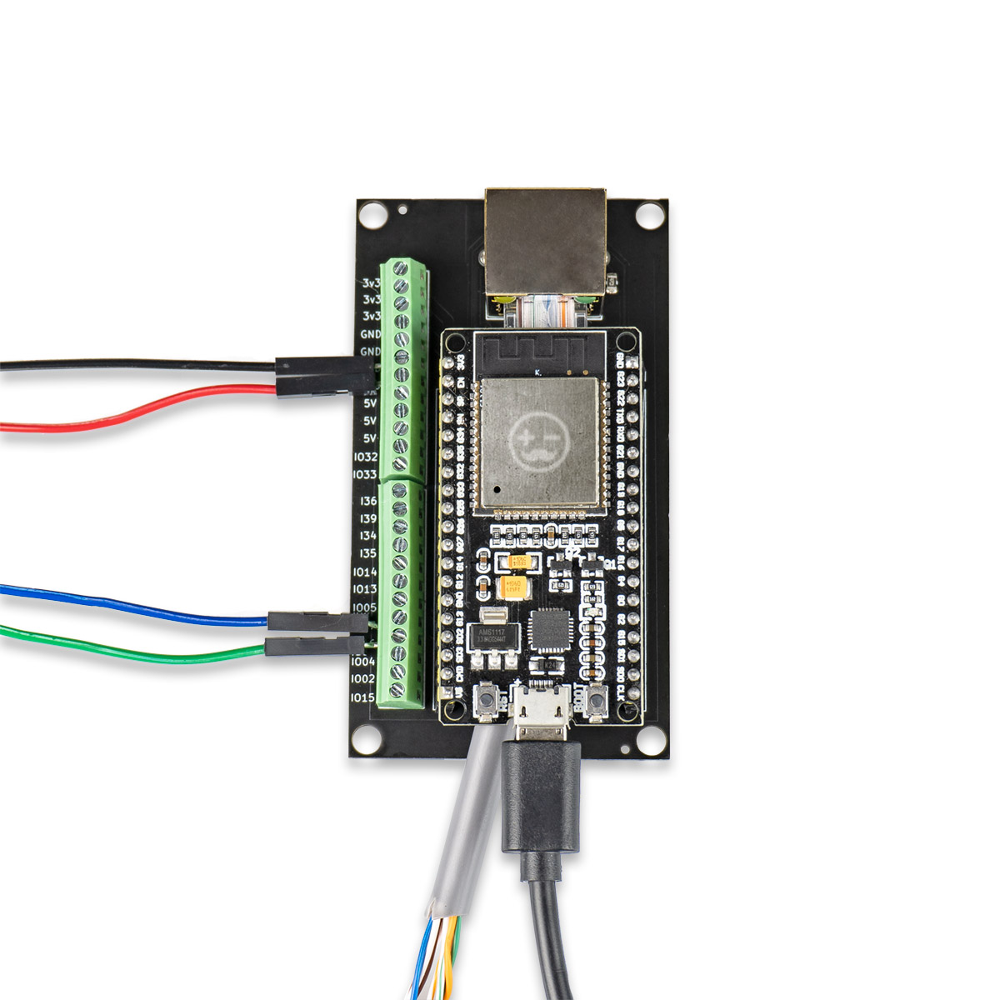
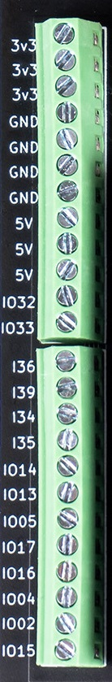
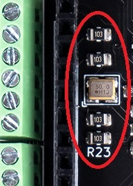

ESP32-DevKitC-LAN8720
===
### (ENGLISH VERSION COMING SOON!)
---

# Indice

* [Informazioni sul progetto](#Informazioni-sul-progetto)
* [Board Pinouts](#Board-Pinouts) 
* Esempio con [Platform.io - VS Code](./examples/PlatformIO/)
* Esempio con [Arduino IDE](./examples/ArduinoIDE/)
* Esempio con [ESPHome & Home Assistant](./examples/ESPHome/) 
* [3D Model](#3D-Model)  

<table><tr><td></td><td></td><td></td></tr></table>

---

# Informazioni sul progetto

L'esp32 è un controller fantastico per l'utilizzo in ambito IOT, ma per applicazioni messe in produzione H24 (anche se non di vitale importanza) ci sono aspetti che spesso vengono sottovalutati (o neanche presi in considerazione) come la stabilità, l'efficienza e la garanzia della connessione di rete. 
 
Il chip LAN8720 è da considerarsi al momento la migliore scelta per una connessione ethernet con esp32. E' possibile convertire un'applicazione wifi senza dover stravolgere il codice e senza doversi preoccupare di eventuali problemi di compatibilità con altre librerie. E' possibile switchare da una connessione wifi ad una ethernet senza troppi problemi. L'utilizzo con EspHome ed Home Assistant è un esempio di facilità di implementazione.
Ciò non è possibile con altre soluzioni come ad esempio il chip W5500. 

Cercando informazioni sul web per connettere i nostri ESP32 DevKitC alla rete tramite un controller LAN8720, si finisce sempre alla soluzione proposta Frank Sautter sul suo blog: https://sautter.com/blog/ethernet-on-esp32-using-lan8720/ ma ci si rende subito conto di 3 cose: 

1) le modifiche fisiche da fare alla scheda ethernet non sono alla portata di tutti.
2) la breadboard diventa presto un groviglio di cavi dupont, causando spesso problemi indesiderati
3) è una soluzione buona per il testing, ma non di certo per un progetto definitivo che deve funzionare a lungo.

Dopo circa un anno di vari test, abbiamo quindi realizzato una board plug&play che risolve tutti i problemi descritti.

### ESP32-DevKitC-LAN8720 aggiunge all'ESP32 DevKitC le funzionalità ethernet tramite il chip LAN8720 ed espone i pin inutilizzati su una comoda morsettiera (screw terminal) alla quale collegare le periferiche.

---

# Board Pinouts
<center>

<table><tr><td valign="top"></td><td valign="top">

### Lo screw terminal sulla sinistra espone i pin inutilizzati dal chip ethernet, che possono essere utilizzati nel tuo progetto e per alimentare la board.

#### ALIMENTAZIONE IN/OUT
  
```
3 x 3.3v
4 x GND
3 x 5v
```  
  
#### INPUT/OUTPUT PINS:
```
IO32
IO33
IO14
IO13
IO05
IO17
IO16
IO04
IO02
IO15
```  
  
#### INPUT PINS


##### (NB: su ognuno di questi pin è già presente una resistenza di pullup da 10k!):
```
I36
I39
I34
I35
``` 
 
 </td></tr></table>
</center>

---

<table><tr><td valign="top">

# 3D Model

Nella [directory 3D-model](./3D-model/) è disponibile il file .step che può essere importato in software per il disegno 3d come fusion 360, per chi volesse realizzare un case da stampare in 3d. 
 
Rilasceremo a breve una nostra versione di case realizzato per la board.</td><td></td></tr></table>

---

# Indice

* [Informazioni sul progetto](#Informazioni-sul-progetto)
* [Board Pinouts](#Board-Pinouts) 
* Esempio con [Platform.io - VS Code](./examples/PlatformIO/)
* Esempio con [Arduino IDE](./examples/ArduinoIDE/)
* Esempio con [ESPHome & Home Assistant](./examples/ESPHome/) 
* [3D Model](#3D-Model)  