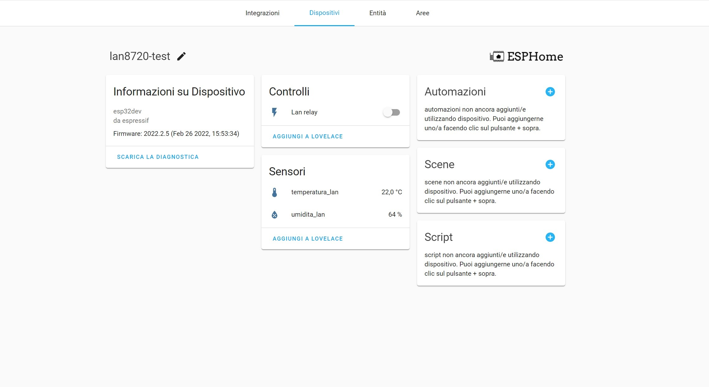

Esempio con ESPHome & Home Assistant
===

* Connetti l'ESP32 tramite usb al pc
* Nel pannello ESPHome in Home Assistant aggiungi un nuovo device e segui le indicazioni
* Edita la configurazione del device appena creato e sostiuisci il suo contenuto con quello del file [lan8720-test.yaml](./lan8720-test.yaml)

